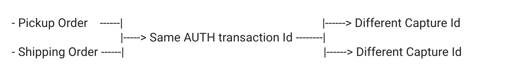

# SPLIT TRANSACTION - PAY PAL EXPRESS

**Date: 20, July, 2022**

## DESCRITPION

- There was an implementation to be worked on for a project in which we were placing mixed orders(2 orders being placed) and paying through Pay Pal as 1 transaction.
- The ask was to differentiate between different orders payments with an individual transaction id.

## ASK/ CHALLANGE

The challanges that were faced while doing a feasibility study for the same:

1. Customer must always see the payment being made as a full amount on frontend.
2. The Payment Action should be authorization. 
3. Individual transaction ids to be shown for each captures.

## PROPOSED SOLUTION

## Requests

### SetExpressCheckout
This method basically sets the transaction amount which in our case would be full amount.

-  **Request:**
`['PAYMENTACTION',
'AMT',
'CURRENCYCODE',
'RETURNURL',
'CANCELURL',
'INVNUM',
'SOLUTIONTYPE',
'NOSHIPPING',
'GIROPAYCANCELURL',
'GIROPAYSUCCESSURL',
'BANKTXNPENDINGURL',
'PAGESTYLE',
'HDRIMG',
'HDRBORDERCOLOR',
'HDRBACKCOLOR',
'PAYFLOWCOLOR',
'LOCALECODE',
'BILLINGTYPE',
'SUBJECT',
'ITEMAMT',
'SHIPPINGAMT',
'TAXAMT',
'REQBILLINGADDRESS',
'USERSELECTEDFUNDINGSOURCE']`

- **Response**: `['TOKEN']`

### GetExpressCheckout

This method validates the token for the transaction before we DoExpressCheckoutPayment
 
- **Request:** `['TOKEN', 'SUBJECT']`

### DoExpressCheckoutPayment

This method does the autorisation of the transaction with full amount. And it returns the Authorisation Id which is the reference ID for different Captures. 

- **Request:**`['TOKEN',
        'PAYERID',
        'PAYMENTACTION',
        'AMT',
        'CURRENCYCODE',
        'IPADDRESS',
        'BUTTONSOURCE',
        'NOTIFYURL',
        'RETURNFMFDETAILS',
        'SUBJECT',
        'ITEMAMT',
        'SHIPPINGAMT',
        'TAXAMT']`
        
- **Response:** `['TRANSACTIONID',
        'AMT',
        'PAYMENTSTATUS',
        'PENDINGREASON',
        'REDIRECTREQUIRED]`
    
### DoCapture

This method get called when we invoice the order and what caught my eye here is the  **`COMPLETETYPE`** paramter we pass in the request. 

We can tell Pay Pal that is this the final transaction or there will be more captures for this transaction id.

So we can send either of these values for this parameter:

	- $request["COMPLETETYPE"] = "NotComplete";
						OR
	- $request["COMPLETETYPE"] = "Complete";

**Note**: *Auth Id to be sent in the request is is basically the Transaction Id we get from DoExpressCheckoutPayment*

- **Request:**`['AUTHORIZATIONID', 'COMPLETETYPE', 'AMT', 'CURRENCYCODE', 'NOTE', 'INVNUM']`
        
- **Response:** ` ['TRANSACTIONID', 'CURRENCYCODE', 'AMT', 'PAYMENTSTATUS', 'PENDINGREASON']`

## REFERENCES

- [Set Express Checkout](https://developer.paypal.com/api/nvp-soap/set-express-checkout-nvp/)
- [Do Express Checkout](https://developer.paypal.com/api/nvp-soap/do-express-checkout-payment-nvp/)
- [Payment Type Fields- set-express-checkout](https://developer.paypal.com/api/nvp-soap/set-express-checkout-nvp/#link-paymentdetailstypefields)
- [Do Auth](https://developer.paypal.com/api/nvp-soap/do-authorization-nvp/)
- [Do Capture](https://developer.paypal.com/api/nvp-soap/do-capture-nvp/)